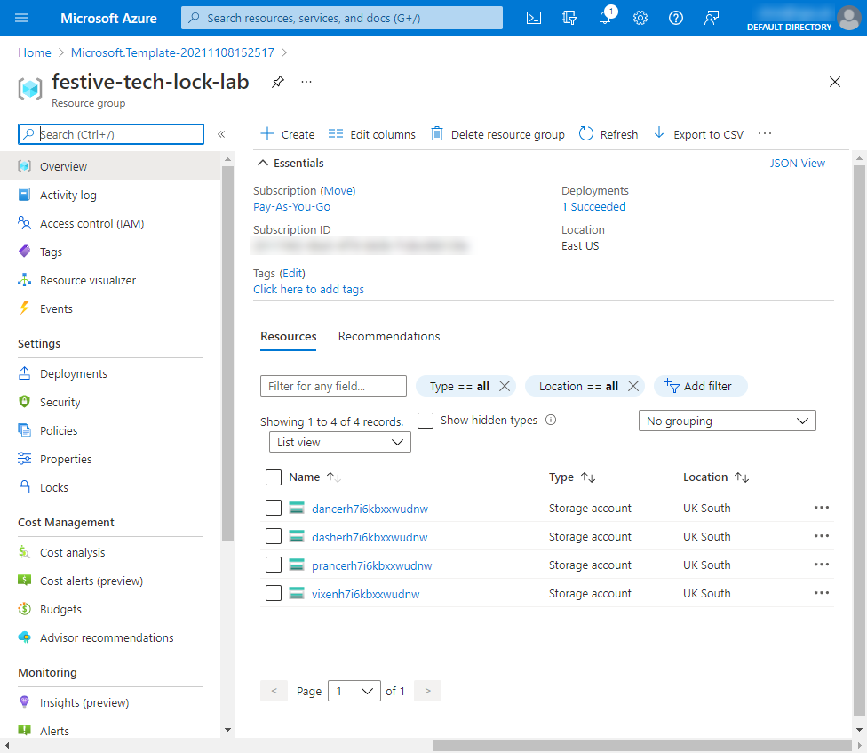
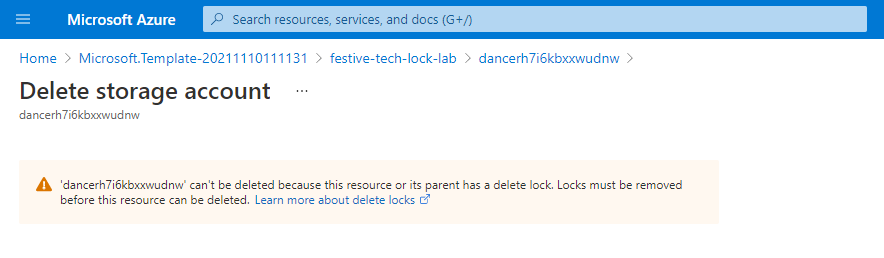
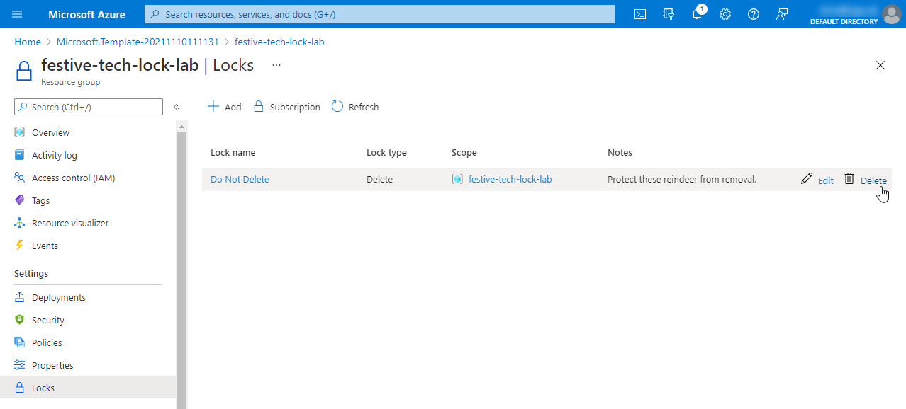

A quick lab based on the demo in the Festive Tech Calendar 2021 session "[Locking Around the Christmas Tree](https://isjw.uk/ftc2021)". 

## Pre-Requisites
You will need an Azure subscription to complete this lab. Azure pass, EA, Pay as you go etc are all appropriate. 


## Exercise 1: Apply  an Azure Resource Lock

### Task 1: Deploy the example resources
In this task you will create a resource group and deploy three example resources.
1. Click on the [``Deploy to Azure``](https://portal.azure.com/#create/Microsoft.Template/uri/https%3A%2F%2Fraw.githubusercontent.com%2Fisjwuk%2Ffestive-tech-calendar-2021%2Fmain%2Fdeploy.json) button below.

[](https://portal.azure.com/#create/Microsoft.Template/uri/https%3A%2F%2Fraw.githubusercontent.com%2Fisjwuk%2Ffestive-tech-calendar-2021%2Fmain%2Fdeploy.json)

2. 	When prompted, authenticate with the user account that has the owner role in the Azure subscription you will be using in this lab.
3. On the ``Custom deployment`` blade configure the following:
    * Select the Azure subscription you will be using in this lab.
    * Under Resource Group click ``Create new`` and enter ``festive-tech-lock-lab`` as the name of the Resource Group before clicking ``OK``.
    * Leave the Region drop-down at it's default value.
    * Click the ``Review + create`` button.
4. When the validation is complete, click the ``Create`` button.
5. Wait for the deployment to complete, this may take a couple of minutes, and then click the ``Go to resource group`` button.

You should now see a Resource Group containing 4 Storage Accounts. The Storage Accounts have reindeer names, but with some random-looking characters appended. This is because Storage Accounts need globally unique names - there can only be one Storage Account called ``rudolph`` across all of Azure, not just your Subscriptions.



### Task 2: Create and test a DoNotDelete Lock
1. In the ``festive-tech-lock-lab`` Resource Group blade, select ``Locks`` from the left hand menu.
2. In the ``Locks`` blade, click on the ``Add`` button in the toolbar
3. A popup will appear, enter the following details then click the ``OK`` button
    * **Lock name:**    ``Do Not Delete``
    * **Lock type:**    ``Delete``
    * **Notes:**        ``Protect these reindeer from removal.``
4. The new lock is now in place and should be listed in the ``Locks`` blade. Click on ``Overview`` in the left hand menu for the Resource Group.

You will now test if the Resource Lock works, you should not be able to delete one of the Storage Accounts.

5. Click on the Storage Account that starts with ``dancer`` to open the blade for that Resource.
6. In the toolbar at the top of the Storage Account blade, click on ``Delete``.

An error should appear: 
```
'dancer.........' can't be deleted because this resource or its parent has a delete lock.
Locks must be removed before this resource can be deleted.
```


7. Click on ``festive-tech-lock-lab`` in the breadcrumbs at the top of the window to return to the Resource Group.

### Task 3: Remove a Lock
1. In the ``festive-tech-lock-lab`` Resource Group blade, select ``Locks`` from the left hand menu.
2. Click the ``Delete`` button to the right of the Lock added in Task 2.



3. The list of Locks will now read ``This resource has no locks``. Click on ``Overview`` in the left hand menu for the Resource Group.

You will now test if the Storage Account can be removed now the Resource Lock works has been deleted.

5. Click on the Storage Account that starts with ``dancer`` to open the blade for that Resource.
6. In the toolbar at the top of the Storage Account blade, click on ``Delete``.

The error you saw in Task 2 will not appear as the Lock has been removed. It its place a warning will be shown asking for confirmation before deleting. 

7. Enter the full name of the ``dancer...`` Storage Account into the box to confirm it is OK to delete, and then click the ``Delete`` button.
8. When that activity completes, click on ``festive-tech-lock-lab`` in the breadcrumbs at the top of the window to return to the Resource Group.
9. You should now only see three Storage Accounts: ``dasher...``, ``prancer...`` and ``vixen...``. Click the ``Refresh`` button on the toolbar if ``dancer...`` is still there and it should disappear.

## Tidy Up
1. Return to the Resource Group blade for ``festive-tech-lock-lab`` in the Azure Portal.
2. Click on ``Delete Resource Group`` in the toolbar
3. You are prompted to confirm you are sure. Enter ``festive-tech-lock-lab`` in the prompt and click the ``Delete`` button.


